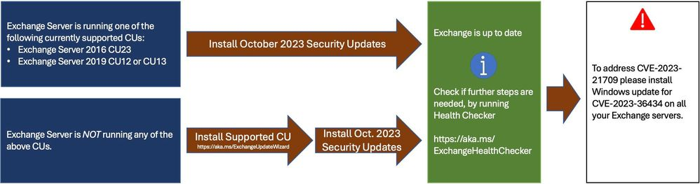

Von Microsoft wurden neue Sicherheitsupdates für Exchange Server 2016 und Exchange Server 2019 veröffentlicht. Das Update schließt die Remote Execution Schwachstelle CVE-2023-36778 und bietet eine bessere Lösung für die Schwachstelle CVE-2023-21709 vom August. Mit dem August Sicherheitsupdate traten viele Probleme auf und das Update wurde zeitweise zurückgezogen. Das Update aus dem Oktober für CVE-2023-36434 für Windows Server liefert nun eine verbesserte Lösung als das IIS Token Cache Module zu deaktivieren. Durch das Update im August wurde dieses nämlich deaktiviert. Nach der Installation des Updates kann der IIS Token Cache wieder aktiviert werden.

Über die folgenden Links geht es zu den Updates:

- Exchange Server 2019 [CU12](https://www.microsoft.com/en-us/download/details.aspx?id=105638) 
- Exchange Server 2019 [CU13](https://www.microsoft.com/en-us/download/details.aspx?id=105637)

- Exchange Server 2016 [CU23](https://www.microsoft.com/en-us/download/details.aspx?id=105639)

Nach der Installation der neuesten Updates vom Oktober kann das IIS Token Cache Modul anschließend mit folgendem Befehl wieder aktiviert werden:

	
`New-WebGlobalModule -Name "TokenCacheModule" -Image "%windir%\System32\inetsrv\cachtokn.dll"`

Quelle: https://techcommunity.microsoft.com/t5/exchange-team-blog/released-october-2023-exchange-server-security-updates/ba-p/3950647

